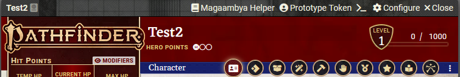
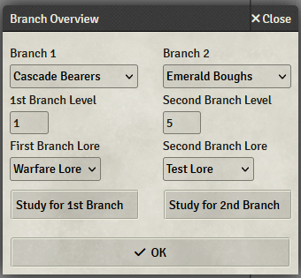

# What is Magaambya Study Helper

The Magaambya Study Helper helps you keep track of your levels in the branches of the Magaambya. It also support you in rolling for Studying/Research.

# How does it work?

When you open a Player Character Actor, the header will have a new button "Magaambya Helper". Click on that button and in the popup that opens, you can configure your current branches and branch levels.

Change your branch and levels in this popup and click "OK" to save the changes to the actor.

The two "Study for xx Branch" Buttons popout a new window that lets you select branch-appropriate skills. When you roll afterwards, the current level of the branch will be used to determine the DC you roll against. The Chat message after rolling will immediately show you the result (i.e. whether you rolled a Success, Crit Success etc.). You still have to manually change your branch level afterwards and click "OK".

**Beware** at this point in time, you HAVE to click "OK" after making any changes to the data (branches or levels) before you can reopen the Dialog and use the "Study for xx Branch" buttons.
